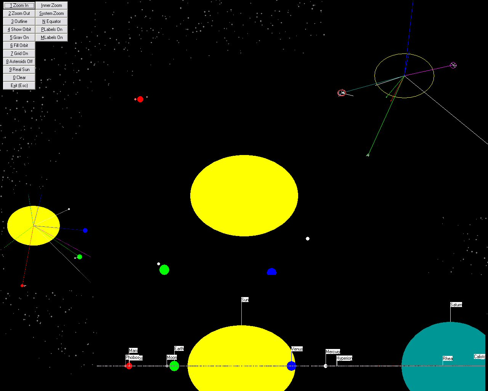



## clsPlanet: Class to Draw a Solar System ver 2

### Description

A single class capable of drawing the solar system from Sun to Pluto (including 1500 asteroids). NEW: Retrograde planets/moons now possible, coloured labels, more comments in code, more accurate numbers, more real moons. You can easily add more or design your own solar system.

. Thanks for inspiration, assistance and support to Peter Wilson whose upload 'A Simple Solar System Simulator, v1.0' http://www.planet-source-code.com/vb/scripts/ShowCode.asp?txtCodeId=47973&lngWId=1 inspired this. 

----

NOTE

----

If it runs too slowly reduce the number of asteroids at Private Const AsteroidNumber As Long = 500 . I have run it with up to 5000 but the graphic is not that much different and very slow. 

----

UPDATED

----

Thanks to Peter Wilson who improved his zooming code and kindly sent it to me.

Upgrade 1 notes: Added a new solar equator view, labels for planets and moons, improved collection based functionality, Asteroids do not display orbits (un-comment piece of code if you like that). All orbits are now eliptical and Pluto has its eccentric orbit . Planets have extra properties (oblate= Flat). 

----

CODERS this class automatically produces the labels it needs to operate without a seed control. Cute Trick extended on article in Computer Shopper Jun 2003.
 
### More Info
 

             |
---                |---
**Submitted On**   |2003-09-03 22:45:02
**By**             |[Roger Gilchrist](https://github.com/Planet-Source-Code/PSCIndex/blob/master/ByAuthor/roger-gilchrist.md)
**Level**          |Intermediate
**User Rating**    |4.9 (54 globes from 11 users)
**Compatibility**  |VB 5\.0, VB 6\.0
**Category**       |[Coding Standards](https://github.com/Planet-Source-Code/PSCIndex/blob/master/ByCategory/coding-standards__1-43.md)
**World**          |[Visual Basic](https://github.com/Planet-Source-Code/PSCIndex/blob/master/ByWorld/visual-basic.md)
**Archive File**   |[clsPlanet\_164055932003\.zip](https://github.com/Planet-Source-Code/roger-gilchrist-clsplanet-class-to-draw-a-solar-system-ver-2__1-48229/archive/master.zip)

